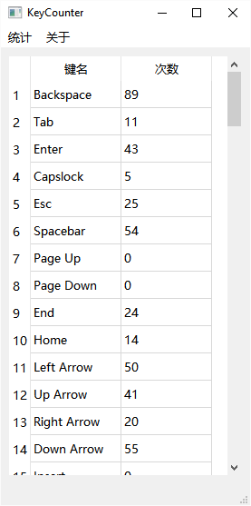

KeyCounter
===

键盘按键统计软件，显示每个按键按下的次数。

覆盖范围：

- 字母键
- 数字键
- 符号键
- 控制键
- 功能键
- 小键盘

参考资料：

- 键码说明：https://blog.csdn.net/weixin_34216036/article/details/93813615

- 按键监控：https://blog.csdn.net/fl2502923/article/details/110915405